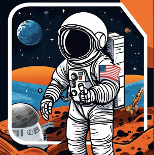

# Apollo 11 Space Game - OVOS Skill  

🚀 **Can you even moon land?**  

Take on the challenge of landing on the moon in this thrilling OVOS adventure voice game. Experience the tension, decision-making, and excitement of a space mission. Will you make it to the lunar surface, or will your choices lead to a premature "Game Over"?  

🎮 This game is a voice-powered port of [Jordan Madrid's Apollo 11 Space Game](https://github.com/jrdnmadrid/Space-Text-Game).  

  

---

## 🌌 Features  

- **Interactive Gameplay**: Your voice controls the story. Make choices and shape the outcome.  
- **Immersive Narrative**: Live the life of an astronaut in a high-stakes mission to the moon.  
- **Challenging Scenarios**: Test your quick thinking and decision-making skills.  

---

## 🚀 How to Play  

1. Start the game with a voice command:  
   **"Start moon game"**  

2. Follow the prompts and make choices by speaking your responses.  

3. Every decision you make has consequences—choose wisely!  

---

## 📖 Sample Gameplay  

```text  
Input: Start moon game  
Game started  
You pull up to the gated compound in your car and greet the guard.  
"Hello, sir, please present your ID."  
Do you present your ID to the guard?  

Input: no  
"Sir, I won't ask you again. Please present your ID," the guard says sternly.  
Will you present your identification?  

Input: insult guard  
"Sir, get your hands on the ground!" he screams. You are now arrested.  
Game Over. Thank you for playing.  
```  

---

## 🔧 Installation  

This skill is designed for the **OpenVoiceOS (OVOS)** ecosystem. Install it via the OVOS Skill Store or follow the standard skill installation process.  

`pip install ovos-skill-moon-game`

---

## 💡 Credits  

This skill is a voice-powered adaptation of [Jordan Madrid's Apollo 11 Space Game](https://github.com/jrdnmadrid/Space-Text-Game).  
